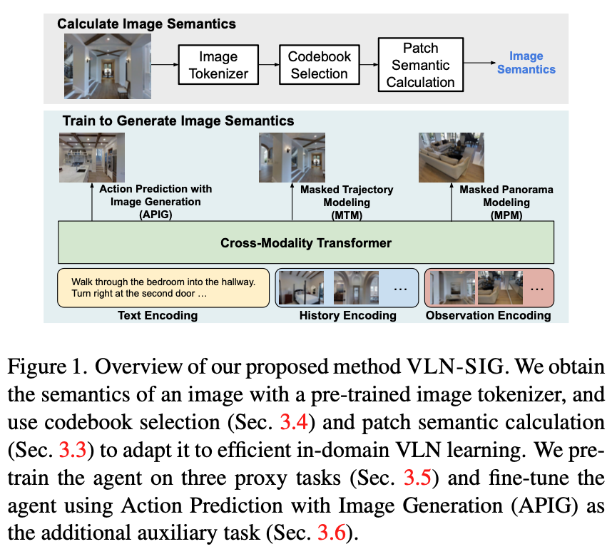
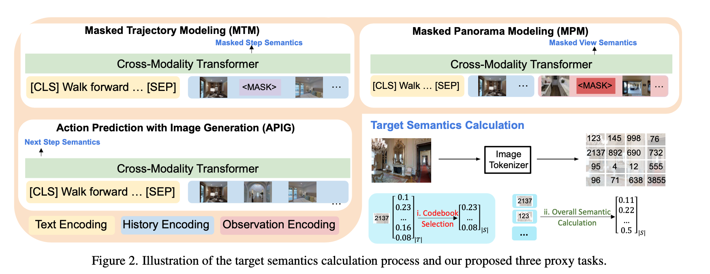

# Improving Vision-and-Language Navigation by Generating Future-View Image Semantics (CVPR 2023)

* Authors: [Jialu Li](https://jialuli-luka.github.io/) and [Mohit Bansal](https://www.cs.unc.edu/~mbansal/) (UNC Chapel Hill)

* [Paper](https://arxiv.org/abs/2304.04907)

Vision-and-Language Navigation (VLN) is the task that requires an agent to navigate through the environment based on natural language instructions. At each step, the agent takes the next action by selecting from a set of navigable locations. In this paper, we aim to take one step further and explore whether the agent can benefit from generating the potential future view during navigation. Intuitively, humans will have an expectation of how the future environment will look like, based on the natural language instructions and surrounding views, which will aid correct navigation. Hence, to equip the agent with this ability to generate the semantics of future navigation views, we first propose three proxy tasks during the agent's in-domain pre-training: Masked Panorama Modeling (MPM), Masked Trajectory Modeling (MTM), and Action Prediction with Image Generation (APIG). These three objectives teach the model to predict missing views in a panorama (MPM), predict missing steps in the full trajectory (MTM), and generate the next view based on the full instruction and navigation history (APIG), respectively. We then fine-tune the agent on the VLN task with an auxiliary loss that minimizes the difference between the view semantics generated by the agent and the ground truth view semantics of the next step. Empirically, our VLN-SIG achieves the new state-of-the-art on both Room-to-Room dataset and CVDN dataset. We further show that our agent learns to fill in missing patches in future views qualitatively, which brings more interpretability over agents' predicted actions. Lastly, we demonstrate that learning to predict future view semantics also enables the agent to have better performance on longer paths.


<p align="center">

</p>

<p align="center">

</p>

## Environment Installation

1. Follow instructions [here](https://github.com/clip-vil/CLIP-ViL/tree/master/CLIP-ViL-VLN) to install Matterport3D simulators.

2. Install requirements:

```bash
pip install -r python_requirements.txt
```

3. Download data

* Download navigation data following instructions [here](https://github.com/cshizhe/VLN-HAMT)

* Download pre-trained dVAE from [here](https://github.com/openai/DALL-E)

* Download pre-extracted CLIP-ViT/16 features and pre-extracted image semantics from [here](https://www.dropbox.com/sh/fftfotbac9878cc/AAD6Al1eRlbm3-lctyoKxWs9a?dl=0)

## Code

### VLN Pre-training
```
bash pretrain_src/scripts/pretrain_r2r.bash
bash pretrain_src/scripts/pretrain_rxr.bash
```

Pre-train on R2R dataset with `pretrain_r2r.bash`, and RxR dataset with `pretrain_rxr.bash`.

In `config/pretrain_r2r.json`:

* `img_db_file`: specify the path to the view images from Matterport3D

* `mim_mask_prob`: mask ratio for Masked Trajectory Modeling

* `mpp_mask_prob`: mask ratio for Masked Panorama Modeling

### VLN Fine-tuning
```
cd finetune_src
bash scripts/run_r2r.sh
bash scripts/run_cvdn.sh
bash scripts/run_rxr.sh
```

* `train_ig`: weight to combine the image generation loss during fine-tuning.

* `ig_path`: path to pre-extracted image token probabilities.


## Citation

If you find this work useful, please consider citing:

```bibtex
@inproceedings{li2023vlnsig,
  title     = {Improving Vision-and-Language Navigation by Generating Future-View Image Semantics},
  author    = {Jialu Li, Mohit Bansal},
  booktitle = {CVPR},
  year      = {2023}
}
```
